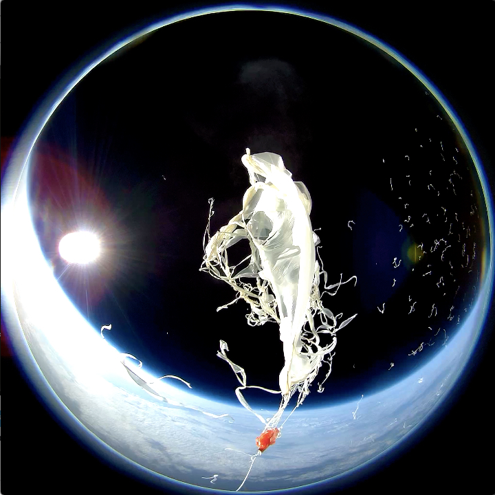
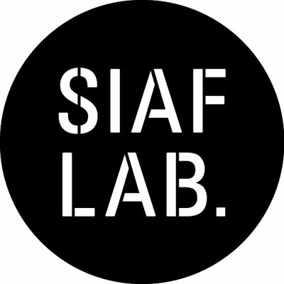

<style type="text/css">
  .reveal h1,
  .reveal h2,
  .reveal h3,
  .reveal h4,
  .reveal h5,
  .reveal h6 {
    text-transform: none;
  }
  .reveal ol,
  .reveal dl,
  .reveal ul {
    font-size: 0.75em;
    display: block;
    text-align: left;
  }
  .reveal section img {
    background: none;
    border: none;
    box-shadow: none;
  }
  .reveal code {
    font-family: monospace;
  }
</style>
### Ruby code from the stratosphere

##### - SIAF, Sonic Pi, Petal



##### Kenichi Kanai @kn1kn1
##### RubyKaigi 2018
###### 2018.06.02 10:50-11:30 Hagi #rubykaigiC

---
#### Ruby code from the stratosphere

```
2017/10/19 21:37:11 `cfdr la:43.213702,lo:141.993971,a:11990.8`
2017/10/19 21:40:19 `d1'v*4 v*2',n:'irand',rate:'irand 1 2'`
2017/10/19 21:41:24 `cps 0.3`
```

---
#### Kenichi Kanai @kn1kn1


- a software engineer at Sapporo
- a member of SIAF LAB.
- a contributor/translator of Sonic Pi
- a software engineer at Farmnote

---
#### [PR] Farmnote

- https://farmnote.jp/
- 「世界の農業の頭脳を創る。」

---
#### Agenda
- Petal
  - Sonic Pi
  - Livecoding
  - TidalCycles
  - Petal Patterns
- SIAF2017
  - space-moere
  - ARTSAT x SIAFLAB
  - Launches

- Session Notes
  - https://gist.github.com/kn1kn1/c28f8029ba5ee069d83b8b6a6c4c8543
  - http://rubykaigi.org/2018/presentations/kn1kn1.html#jun02

---
#### Petal


- https://github.com/siaflab/petal
- a small language on [Sonic Pi](http://sonic-pi.net/) with similar syntax to [TidalCycles](https://tidalcycles.org).
- developed by me
---
#### Sonic Pi


- http://sonic-pi.net/
- "The Live Coding Music Synth for Everyone"
- developed by Sam Aaron
- Ruby

---
- http://rubykaigi.org/2016/presentations/juliancheal.html
  - Julian Cheal at RubyKaigi 2016

- Mario theme
  - written by Xavier Riley(@xavriley), Sonic Pi main committer
  - Making Chiptune Music using Sonic Pi v2.0
  - https://gist.github.com/xavriley/87ef7548039d1ee301bb

---
- Repl Electric - You fall into your screen
  - https://vimeo.com/265785040#t=40s
  - performed by Joseph Wilk(@josephwilk‏), Sonic Pi main committer

- Live coding at CCSS2015 Closing Party
  - https://vimeo.com/137140871#t=40s
  - performed by me
  - https://github.com/kn1kn1/ccss2015

---
#### Livecoding

- live coders expose and rewire the innards of software while it generates improvised music and/or visuals.
  - 「コンピュータの言語であるプログラムコードを直接操作することで、さまざまな音や映像をリアルタイムに生成する即興演奏の方法」

- TopLap https://toplap.org/
  - livecoding manifest
  - https://toplap.org/wiki/ManifestoDraft

---
- Languages
  - ChucK
  - Extempore
  - Fluxus
  - Gibber
  - Max
  - Pure Data
  - SuperCollider
  - Overtone
    - using SuperCollider from Clojure
  - Sonic Pi
    - using SuperCollider from Ruby
  - TidalCycles
    - using SuperCollider from Haskell

- https://github.com/toplap/awesome-livecoding/
---
- Algorave https://algorave.com/
  - rave events by livecoder
  - guideline: https://github.com/Algorave/guidelines/blob/master/README.md

- 6/3 (tommorow) Algorave Tokyo
  - http://algorave.tokyo/

---
#### TidalCycles


- https://tidalcycles.org/
- developed by Alex McLean
- Haskell
- `a language for live coding patterns.`

---
- `an open source live coding environment based off of his 16 years of experience with making algorithmic dance music.`
  - 'Alex McLeanの16年にわたるアルゴリズミックなダンスミュージックの制作経験を基にしたライブコーディング環境'
  - https://courses.ideate.cmu.edu/15-104/f2016/2016/09/23/rgriswol-lookingoutwards-04/
- simple notation generates complex sounds
  - 簡単な記法で複雑な音楽を記述可能

---
- moxus + TokisatoMiztsuru - Algosix Live Stream Performance - March 17, 2018 08:30 UTC
  - https://www.youtube.com/watch?v=uK3tS8VNUvY&t=60
  - performed by @moxus

---
- Alex McLean will visit Japan between 8th and 18th November
  - https://slab.org/live-coding-tokyo-yorkshire/

---
#### Petal


- https://github.com/siaflab/petal
- a small language on [Sonic Pi](http://sonic-pi.net/) with similar syntax to [TidalCycles](https://tidalcycles.org).

---
#### Petal (Tidal) patterns

- one bass drum per cycle
```ruby
d1 'bd'
```

- two bass drums per cycle
```ruby
d1 'bd bd'
```

- nested bass drums
```ruby
d1 'bd [bd bd]'
```

- specifying tempo (cps: cycle per second)
```ruby
cps 2
d1 'bd [bd bd]'
```
---

- index option
```ruby
d1 'v', n: 1
```

- rate option
```ruby
d1 'v', rate: 4
```

- randomize
```ruby
d1 'v', rate: 'irand 1 2'
```

---
#### Ruby code from the stratosphere

```
2017/10/19 21:37:11 `cfdr la:43.213702,lo:141.993971,a:11990.8`
2017/10/19 21:40:19 `d1'v*4 v*2',n:'irand',rate:'irand 1 2'`
2017/10/19 21:41:24 `cps 0.3`
```
---

- Euclidean rhythm
```ruby
d1 'bd(5,8)'
```
  - 5: pulse、8: step

- [Godfried Toussaint(2005) "The Euclidean Algorithm Generates Traditional Musical Rhythms"](http://cgm.cs.mcgill.ca/~godfried/publications/banff.pdf)
  - The Euclidean algorithm which computes the greatest common divisor of two given integers may be used to generate traditional musical rhythms.
    - 「2つの数の最大公約数を求めるユークリッドのアルゴリズムをリズムに適用することにより、伝統的なリズムを記述可能である。」
  - The first number of sounds (5) will be distributed equally across the second number of steps (8).
    - 上の例では、2つめの数(8)のステップを通じて、最初の数(5)のパルスを等間隔で分散させようとします。

- http://dbkaplun.github.io/euclidean-rhythm/

---

```ruby
require "~/github/petal/petal.rb"

cps 0.5

d1 ":bd_klub(11,16)"
d2 ":bd_haus(6,16)"
d3 "hh(13,16)", rate: 'rand -1 1'
d4 "if(11,16)", n: 'irand 64', rate: 'rand -1 1'
```

- https://vimeo.com/223727860

---
#### Inside Petal

- TidalCycles pattern is something like...
  - `"bd"`, `"bd bd"`, `"bd [bd bd]"`
  - `"[bd]"`, `"[bd bd]"`, `"[bd [bd bd]]"`
  - `"(bd)"`, `"(bd bd)"`, `"(bd (bd bd))"`

- `How to Write a (Lisp) Interpreter (in Ruby)` by @melborne
 - https://melborne.github.io/2010/11/10/Ruby-Lisp/

---
- create Cycle object by parsing code text
  - https://github.com/siaflab/petal/blob/master/petal_data.rb
  - https://github.com/siaflab/petal/blob/master/petal.rb#L173

- play sounds with Cycle object
  - https://github.com/siaflab/petal/blob/master/petal.rb#L197-L203

---
- Euclidean Rhythm library
  - https://github.com/kn1kn1/EuclideanRhythm

---
#### SIAF2017

- https://siaf.jp/2017/

---
#### ARTSAT x SIAF LAB.


- Sculpture to be Seen from Space, Improvisation to be Heard from Space.
- 宇宙から見える彫刻、宇宙から聞こえる即興演奏
  - https://siaf.jp/2017/en/artists/artsat-siaflab.html
  - http://space-moere.org/

---
#### ARTSAT x SIAF LAB.


- ARTSAT
- SIAF LAB

---
#### ARTSAT


- `Art and Satellite Project`

- collaboration with Tama Art University and the University of Tokyo
- promoting the cultural and artistic use of the universe with the motto “Satellites as media.”

---
- In February 2014, the world’s first art satellite “ARTSAT 1: INVADER” was launched.
- In December 2014, “ARTSAT 2: DESPATCH,” a deep space sculpture capable of leaving the gravitational sphere of the earth was launched into heliocentric orbit at the same time as the “Hayabusa 2.”

---
#### SIAF LAB.


- began activities from 2015, the year after SIAF2014.
- conducts civil collaborative projects
  - art-related lecture series
  - “Bent Icicle Project – Tulala”

---
#### Sonic Pi and SIAF LAB.
- organize Sonic Pi workshop for 3 times from 2015

- translate Sonic Pi application and tutorials into Japanese
  - https://github.com/samaaron/sonic-pi#translations

- create extension package for Sonic Pi
  - Haskap Jam Pack
  - https://github.com/siaflab/haskap-jam-pack/

---
#### Moerenuma park
- designed by Isamu Noguchi
- it “constitutes one sculptural work as a whole.”


- http://moerenumapark.jp/english/

---
#### Launches

- 2017-07-01 - 1st trial launch for exhibition
- 2017-07-17 - 2nd trial launch for exhibition
- 2017-08-23 - 1st launch with performance (FAIL)
- 2017-10-07 - 3rd trial launch (with revised system)
- 2017-10-19 - 2nd launch with performance
---
#### 2017-07-01 - 1st trial launch for exhibition
- http://daily.siaf.jp/1629/

---
#### System (gorgeous, but it FAILED)


---
- Live-coding performance 22.Aug.2017
  - https://www.youtube.com/watch?v=5pka7xB2eh8
  - https://youtu.be/5pka7xB2eh8?t=4160
---
#### Revised system


---
#### VirtualFPV

- created by @aike1000 (Keisuke Ai) SmileBoom
  - https://github.com/siaflab/VirtualFPV_balloon_trajectory_visualizer

---
#### Ruby code from the stratosphere

```
2017/10/19 21:37:11 `cfdr la:43.213702,lo:141.993971,a:11990.8`
2017/10/19 21:40:19 `d1'v*4 v*2',n:'irand',rate:'irand 1 2'`
2017/10/19 21:41:24 `cps 0.3`
```

---
#### space-moere-flight-data
- https://github.com/siaflab/space-moere-flight-data
- 20171019
  - https://github.com/siaflab/space-moere-flight-data/blob/master/171019/171019o1.log
  - https://github.com/siaflab/space-moere-flight-data/blob/master/171019/171019o2.log

- ARTSAT × SIAF LAB. Livecoding Performance at Gwangju Media Art Festival 2017 (short ver)
  - https://www.youtube.com/watch?v=248V83NYL-w

---
- Midsummer Festival (夏至祭 Geshisai) at Moerenuma park
  - https://space-moere.org/midsummer/


---

